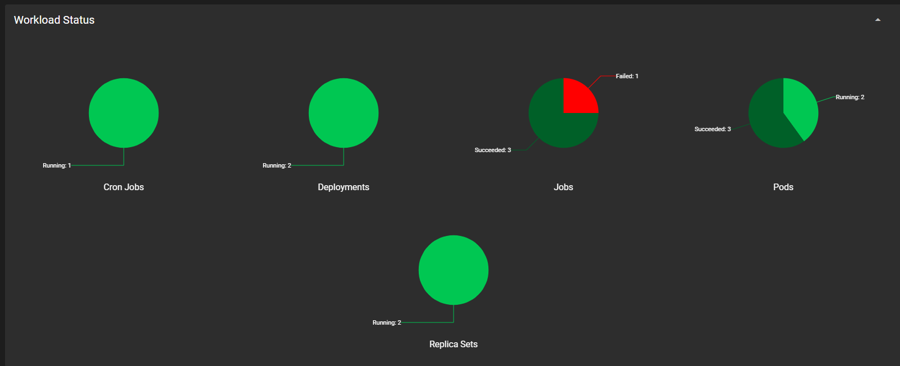
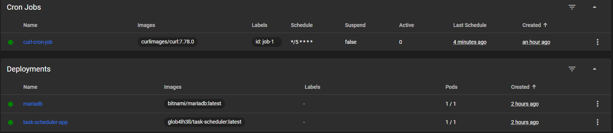
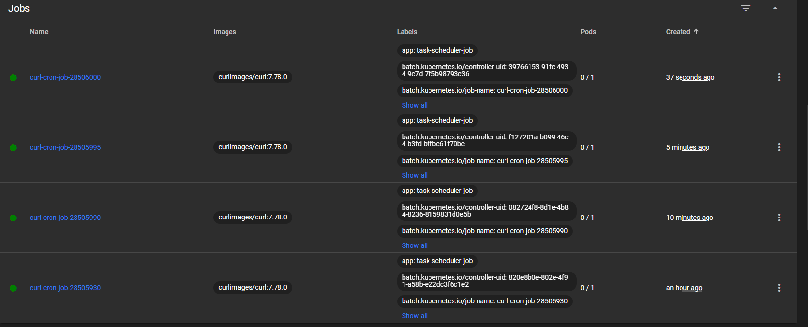
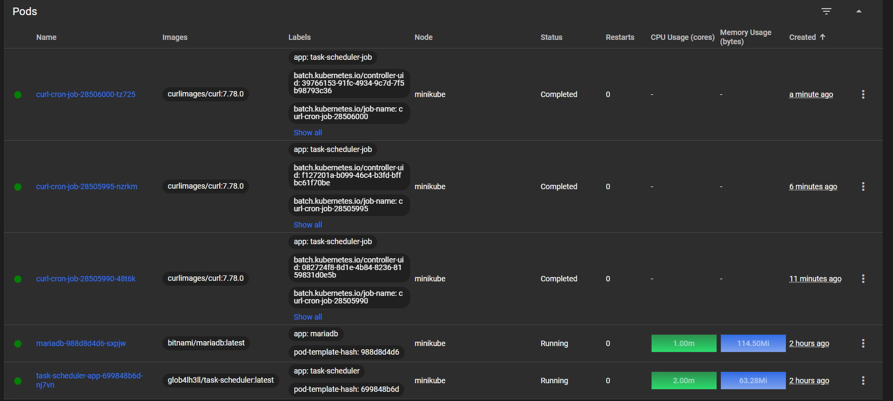
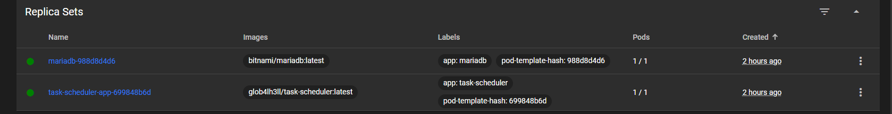

# TaskScheduler
TaskScheduler is a robust and scalable task scheduling application, featuring a Dockerized environment, 
Kubernetes deployment configurations, RESTful API endpoints for task management, and database migrations 
handled by Alembic, designed for efficient task execution and management.

## Directory Structure

```table
/TaskScheduler
├── Dockerfile
├── README.md
├── alembic
│   └── <alembic files>
├── alembic.ini
├── app
│   ├── __init__.py
│   ├── crud.py
│   ├── database.py
│   ├── main.py
│   ├── models.py
│   ├── routes
│   │   ├── __init__.py
│   │   └── task_router.py
│   ├── schemas.py
│   └── task_executor.py
├── docker-compose.yml
├── entrypoint.sh
├── init-db.sql
├── k8s
│   ├── .env
│   ├── app
│   │   ├── chart
│   │   │   └── job-chart
│   │   │       ├── Chart.yaml
│   │   │       ├── templates
│   │   │       │   └── cron-job.yaml
│   │   │       ├── values.yaml
│   │   │       └── .helmignore
│   │   ├── jobs
│   │   │   └── crud-job.yaml
│   │   └── main
│   │       ├── app-config.yaml
│   │       ├── app-d.yaml
│   │       ├── db-credentials.yaml
│   │       └── maria-d.yaml
│   └── init-db.sql
├── poetry.lock
├── pyproject.toml
```

### File Descriptions

- `Dockerfile`: Defines the Docker container configuration for building the TaskScheduler application.
- `README.md`: Offers an overview and documentation for the TaskScheduler project.
- `alembic/`: Contains Alembic migration scripts for database schema updates.
    - `alembic.ini`: Configuration file for Alembic, specifying how database migrations are handled.
- `app/`: The application's core directory, housing the Python code for task management, database interaction, and API routing.
- `docker-compose.yml`: YAML file for defining and running multi-container Docker applications, used to orchestrate the TaskScheduler service and its dependencies.
- `entrypoint.sh`: Shell script executed at the start of the Docker container to set up the environment or perform initial tasks.
- `init-db.sql`: SQL script for initial database setup, creating necessary tables and seeding data.
- `k8s/`: Contains Kubernetes configuration files (manifests) for deploying the TaskScheduler application in a Kubernetes cluster.
- `poetry.lock`: Automatically generated file by Poetry to lock dependencies to specific versions, ensuring consistent builds.
- `pyproject.toml`: Configuration file for Poetry, specifying project details and dependencies.


## Running Locally

If running locally, ensure that you have Python 3.8 or higher installed on your machine.
Run using the following command:

```
$ poetry run uvicorn app.main:app --reload
```

Application will be running at the following ports:

- http://127.0.0.1:8000/

```json
{"message":"Welcome to the Task Scheduler API!"}
```

- http://127.0.0.1:8000/api/tasks/
It will parse the list of tasks from the database and return them in JSON format.

```json
[{"name":"Second Updated Task","scheduled_time":"2024-04-20T10:00:00","recurrence":"weekly","id":1},{"name":"Finish reading 'Atomic Habits'","scheduled_time":"2024-05-01T10:00:00","recurrence":"once","id":2},{"name":"Begin learning Spanish on Duolingo","scheduled_time":"2024-09-01T09:00:00","recurrence":"daily","id":3},{"name":"Start a daily meditation practice","scheduled_time":"2024-08-01T07:00:00","recurrence":"daily","id":4},{"name":"Run a half marathon","scheduled_time":"2024-07-01T06:00:00","recurrence":"once","id":5},{"name":"Complete the Python Advanced course","scheduled_time":"2024-06-01T10:00:00","recurrence":"once","id":6},{"name":"Task After Deletion","scheduled_time":"2024-10-01T10:00:00","recurrence":"once","id":7},{"name":"Play cricket","scheduled_time":"2024-03-15T15:00:00","recurrence":"weekly","id":8}]
```

- http://127.0.0.1:8000/api/tasks/2
It will parse the task with id 2 from the database and return it in JSON format.

```json
{"name":"Finish reading 'Atomic Habits'","scheduled_time":"2024-05-01T10:00:00","recurrence":"once","id":2}
```

!Note: Before running the application, ensure that the database is running and the database URL is correctly set in the environment variables.

## Documentation
After running the application locally we can access the documentation of API at the following URL:

- [Redoc](http://127.0.0.1:8000/redoc)

# Run Image Using Docker 
Make sure you have `Docker` & `docker-compose` installed on your machine.

- Clone the reository and navigate to the root directory of the project.

```
$ git clone git@github.com:RohitRathore1/TaskScheduler.git
```

- Build the Docker image using the following command:
```
$ docker build -t task-scheduler .
```

- Run the Docker container using the following command:
```
$ docker compose up
```

- Create a new task using the following command:
```bash
(base) TeAmP0is0N@laas3-host:~/TaskScheduler$ . /home/TeAmP0is0N/.cache/pypoetry/virtualenvs/taskscheduler-psVrb7oN-py3.11/bin/activate
(taskscheduler-py3.11) (base) TeAmP0is0N@laas3-host:~/TaskScheduler$ curl -X 'POST' \
>   'http://127.0.0.1:8000/api/tasks/' \
>   -H 'accept: application/json' \
>   -H 'Content-Type: application/json' \
>   -d '{
>   "name": "Attend coding webinar",
>   "scheduled_time": "2024-04-10T18:00:00",
>   "recurrence": "once"
> }'
{"name":"Attend coding webinar","scheduled_time":"2024-04-10T18:00:00","recurrence":"once","id":9}(taskscheduler-py3.11) (base)
```

- Access the application at the following URL:
    - http://127.0.0.1:8000/
    ```json
    {"message":"Welcome to the Task Scheduler API!"}
    ```
- Access the documentation of API at the following URL:
    - [Redoc]([http://](http://127.0.0.1:8000/redoc)

- Fetch the list of tasks from the database and return them in JSON format.
    - http://127.0.0.1:8000/api/tasks/
    ```json
    [{"name":"Attend coding webinar","scheduled_time":"2024-04-10T18:00:00","recurrence":"once","id":1},{"name":"Weekly Grocery Shopping","scheduled_time":"2024-03-20T10:00:00","recurrence":"weekly","id":2},{"name":"Monthly Subscription Renewal","scheduled_time":"2024-04-01T12:00:00","recurrence":"monthly","id":3},{"name":"Annual Health Checkup","scheduled_time":"2024-05-15T09:00:00","recurrence":"yearly","id":4},{"name":"Daily Morning Yoga","scheduled_time":"2024-03-25T07:30:00","recurrence":"daily","id":5},{"name":"Biweekly Project Meeting","scheduled_time":"2024-03-28T14:00:00","recurrence":"biweekly","id":6}]
    ```

- Parse the task with id 2 from the database and return it in JSON format.
    - http://http://127.0.0.1:8000/api/tasks/2
    ```json
    {"name":"Weekly Grocery Shopping","scheduled_time":"2024-03-20T10:00:00","recurrence":"weekly","id":2}
    ```

As per your needs you can add more tasks like this. The DB will look like this:

```sql
MariaDB [taskscheduler]> SELECT * FROM tasks;
+----+------------------------------+---------------------+------------+
| id | name                         | scheduled_time      | recurrence |
+----+------------------------------+---------------------+------------+
|  1 | Attend coding webinar        | 2024-04-10 18:00:00 | ONCE       |
|  2 | Weekly Grocery Shopping      | 2024-03-20 10:00:00 | WEEKLY     |
|  3 | Monthly Subscription Renewal | 2024-04-01 12:00:00 | MONTHLY    |
|  4 | Annual Health Checkup        | 2024-05-15 09:00:00 | YEARLY     |
|  5 | Daily Morning Yoga           | 2024-03-25 07:30:00 | DAILY      |
|  6 | Biweekly Project Meeting     | 2024-03-28 14:00:00 | BIWEEKLY   |
+----+------------------------------+---------------------+------------+
6 rows in set (0.001 sec)
```

- Check the newly created task using the following command:
```bash
MariaDB [taskscheduler]> SHOW TABLES;
+-------------------------+
| Tables_in_taskscheduler |
+-------------------------+
| tasks                   |
+-------------------------+
1 row in set (0.001 sec)

MariaDB [taskscheduler]> SELECT * FROM tasks;
+----+------------------------------+---------------------+------------+
| id | name                         | scheduled_time      | recurrence |
+----+------------------------------+---------------------+------------+
|  1 | Attend coding webinar        | 2024-04-10 18:00:00 | ONCE       |
|  2 | Weekly Grocery Shopping      | 2024-03-20 10:00:00 | WEEKLY     |
|  3 | Monthly Subscription Renewal | 2024-04-01 12:00:00 | MONTHLY    |
|  4 | Annual Health Checkup        | 2024-05-15 09:00:00 | YEARLY     |
|  5 | Daily Morning Yoga           | 2024-03-25 07:30:00 | DAILY      |
|  6 | Biweekly Project Meeting     | 2024-03-28 14:00:00 | BIWEEKLY   |
+----+------------------------------+---------------------+------------+
6 rows in set (0.001 sec)
```

In the same way we can perform other CRUD operations using the API.

# Run Image Using Kubernetes

Start by deploying the application within the Kubernetes cluster. Navigate to the `k8s/app` directory and apply the 
Kubernetes configurations for the deployment and service:

```bash
$ cd k8s/app
$ kubectl apply -f main/
```

This step will initiate the deployment and service for the TaskScheduler application, making it operational within 
your Kubernetes cluster.

## Scheduling Jobs in Kubernetes

After deploying the application, you can schedule jobs in Kubernetes to execute tasks at specific times.

### Method 1: Manual CronJob Creation

For manual job creation, examples can be found in the `jobs/` directory. You'll need to specify the job name and 
schedule (in cron format) within the yaml file. To create and schedule the job, apply the yaml file with kubectl:

```bash
kubectl apply -f crud-job.yaml
```

This command creates the job in Kubernetes, and it will be triggered according to the specified schedule.

### Method 2: Using Helm Chart

An easier alternative for job creation is using a Helm chart. Navigate to the `chart/job-chart` directory and run 
the following command, adjusting the `name`, `id`, and `schedule` values as necessary:

```bash
$ cd chart/job-chart
$ helm install release1 . --set name=job-name --set id=3 --set schedule="*/1 * * * *"
```

This command installs the job using Helm, with the flexibility to customize the job's name, unique identifier (id), 
and execution schedule. To preview the job YAML configuration generated by Helm, execute the helm template command 
in the job chart directory:

```bash
$ helm template .
---
# Source: job-chart/templates/cron-job.yaml
apiVersion: batch/v1
kind: CronJob
metadata:
  name: my-curl-cron-job
  labels:
    id: job-2
spec:
  schedule: "*/1 * * * *"
  jobTemplate:
    spec:
      template:
        metadata:
          labels:
            app: task-scheduler-job
        spec:
          containers:
          - name: curl-container
            image: curlimages/curl:latest
            command: ["sh", "-c"]
            args:
            - |
              curl -X 'POST' \
                  'http://task-scheduler-service:8000/api/tasks/' \
                  -H 'accept: application/json' \
                  -H 'Content-Type: application/json' \
                  -d '{
                  "name": "my-curl-cron-job",
                  "scheduled_time": "2024-03-20T10:00:00",
                  "recurrence": "weekly"
                }'
          restartPolicy: OnFailure
```

This provides an overview of the job configuration that will be applied, including the name, schedule, 
and other parameters specified during the Helm chart installation.

## Monitoring and Managing Jobs

Once the job is created, it will execute according to the defined schedule. You can monitor job execution 
and manage jobs using standard Kubernetes commands like `kubectl get jobs` and `kubectl describe job <job-name>`.

## Minikube Dashboard

If you're using Minikube, you can access the Kubernetes dashboard to monitor and manage jobs.

```bash
$ minikube dashboard
```

This command opens the Minikube dashboard in your default web browser, providing a visual interface to monitor.
Below are the screenshots of the dashboard.








# Database Schema

The application uses a MariaDB database to manage tasks. The database schema is designed to store tasks with their 
details. Below is the documentation of the database schema, including the table structure and the relationships 
between them.

- Tables

`tasks`
This table stores the main information about tasks. Each task has an ID, a name, a scheduled time, and a recurrence pattern.

- `id (INT, auto-increment, primary key)`: Unique identifier for each task.
- `name (VARCHAR(255), not null, unique)`: The name of the task. Each task must have a unique name.
- `scheduled_time (DATETIME, not null)`: The date and time when the task is scheduled to be executed.
- `recurrence (ENUM('ONCE', 'DAILY', 'WEEKLY', 'BIWEEKLY', 'MONTHLY', 'QUARTERLY', 'YEARLY'), null)`: The recurrence pattern 
of the task. This field can be null if the task is a one-time task.

- Schema Definition

```sql
CREATE TABLE IF NOT EXISTS tasks (
  id INT AUTO_INCREMENT PRIMARY KEY,
  name VARCHAR(255) NOT NULL UNIQUE,
  scheduled_time DATETIME NOT NULL,
  recurrence ENUM('ONCE', 'DAILY', 'WEEKLY', 'BIWEEKLY', 'MONTHLY', 'QUARTERLY', 'YEARLY') NULL
);
```

- Relationships

The current schema is simple and does not have relationships between tables. However, if the application grows and more tables 
are added, relationships may be established using foreign keys to connect related data across different tables.
